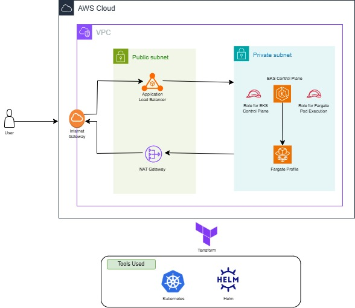

# 🎮 EKS 2048 Game Deployment on AWS

This project demonstrates how to deploy the classic **2048 game** on **Amazon EKS** using **Fargate** and expose it externally via the **AWS Load Balancer Controller**.

---

## 🚀 Why This Project?

This project isn’t just about playing a game — it’s about **learning how to architect and run real-world applications** using **Kubernetes on AWS**. Here's what I learns from this.

- How to **build a serverless EKS cluster** (no EC2 nodes!)
- How to run apps using **AWS Fargate**
- How to expose Kubernetes apps using **Ingress and ALB**
- How the **AWS Load Balancer Controller** dynamically provisions networking resources
- How to deploy lightweight, scalable apps on **production-grade AWS infrastructure**

> 🔧 This project simulates how you'd expose real microservices or web apps in production with zero node management.

---
## 🗺️ Architecture Diagram
This is the diagarm for AWS Cloud Architecture for project.(Codes used to build Terraform) <br>



This is the diagarm for Kubernetes that is deployed in EKS. (Codes used to build Terraform) <br>


---

## 🛠️ Services & Tools Used

| Tool/Service                      | Purpose                                      |
|-----------------------------------|----------------------------------------------|
| **Amazon EKS**                    | Managed Kubernetes cluster                   |
| **AWS Fargate**                   | Serverless compute engine for pods           |
| **AWS Load Balancer Controller**  | Creates ALBs from Ingress resources          |
| **Application Load Balancer**     | Public entry point for the app               |
| **Kubernetes (kubectl)**          | App deployment and cluster interaction       |
| **Helm**                          | Used to install AWS Load Balancer Controller     |
| **2048 Docker App**               | Lightweight static web app for demonstration |

---

## 🌐 Access the App

After deployment, the 2048 game is available at the external ALB endpoint provided by the AWS Load Balancer Controller.

> Working 2048 game accessible in the browser.


---

## 🧪 How to Reproduce

1. **Clone the repo**
   
   `git clone https://github.com/KHS-cpu/eks-2048.git`
   `cd eks-2048`

2. **Deploy infrastructure**
   
   ```bash
   cd terraform
   terraform init
   terraform apply
   ```
3. **If you are stuck on coredns creation use below**
   ```bash
   aws eks update-kubeconfig --name <cluster-name> --region <used-region>
   kubectl patch deployment coredns -n kube-system --type json -p='[{"op": "remove", "path": "/spec/template/spec/tolerations"}]'
   ```
   Cancel the current terraform run which is stuck and rerun
   ```bash
   terraform apply
   ```
4. **The Load Balancer is created automatically via AWS load balancer controller which translates Kubernetes Ingress/Service into AWS ALB/NLB config**


---

## 🔮 Future Enhancements

1. **🔐 HTTPS with ACM & Ingress Annotations**
   Enable TLS termination using AWS Certificate Manager and Ingress annotations to secure traffic end-to-end.
2. **📊 Monitoring & Logging**
   Integrate Amazon CloudWatch, Prometheus, and Grafana to monitor pod health, latency, and traffic patterns.
3. **⚙️ GitOps with ArgoCD**
   Manage deployments declaratively using ArgoCD or Flux, enabling full CI/CD automation from GitHub.
4. **📦 External DNS Integration**
   Automatically update Route 53 DNS records via the external-dns controller.
5. **🌍 Multi-environment Setup**
   Add support for dev, staging, and prod environments using namespaces and separate Fargate profiles.


   
